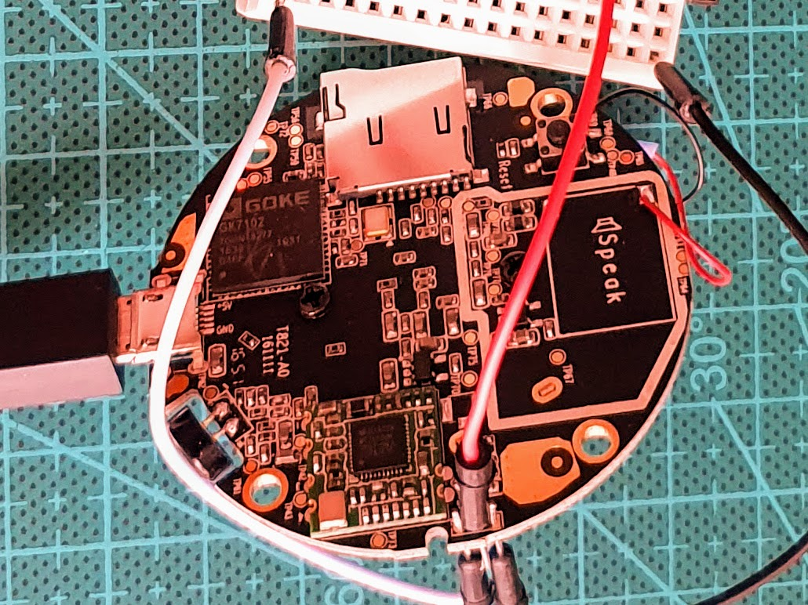
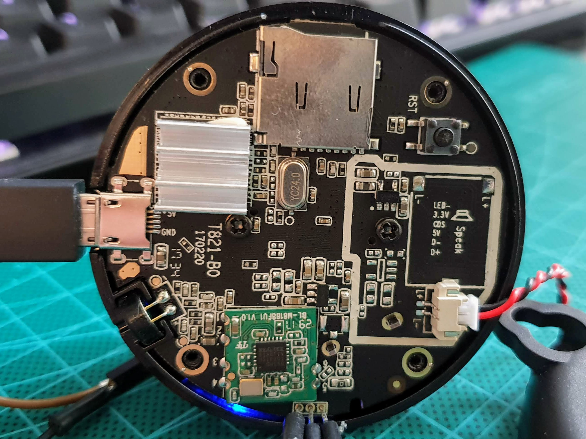
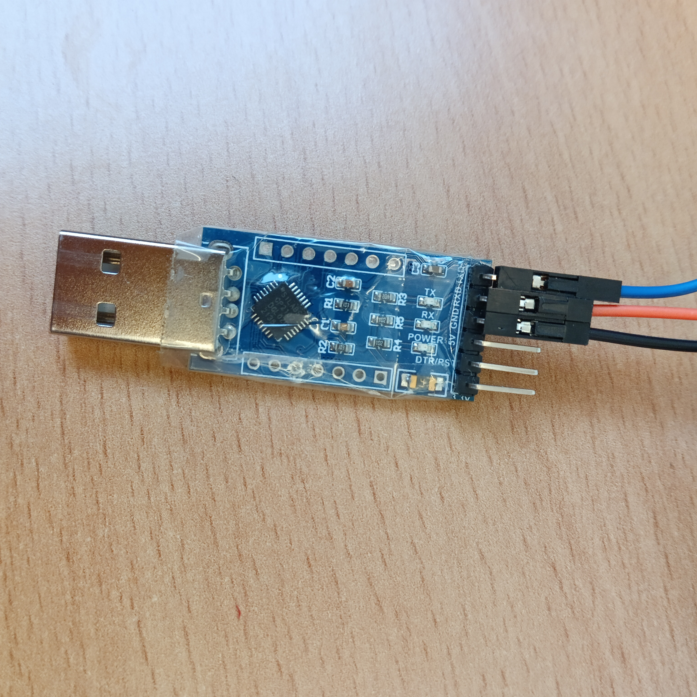
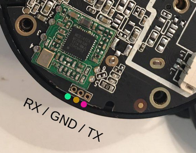
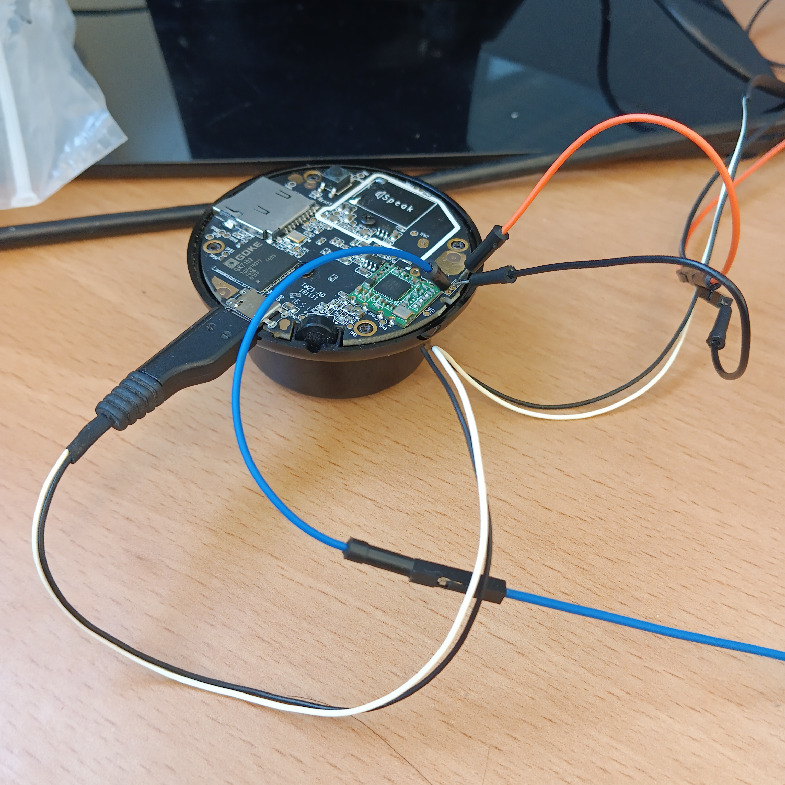

# Caseta Camara Digoo DG M1Q

Este tutorial trata de documentar los pasos seguidos para conectar una camara Digoo DG M1Q y añadir funcionalidades y bloquear el envío de información a terceros.

#### IMPORTANTE

ESTE TUTORIAL ESTA PROBADO PARA LA VERSIÓN ANTIGUA

Existen dos versiones de la cámara:

ANTIGUA

NUEVA



## Requisitos
- Una tarjeta SD (uso temporal- hay tarjetas que no las detecta bien)
- Adaptador USB a Serie (3.3V) + Cables Dupont (requerido sólo - paso 1 - opción 1)



## ¿Como compruebo si la SD funciona correctamente?

Al conectarla en formato FAT32 te creará una carpeta npc con varias subcarpetas.

## Paso 1 - Conectar la cámara al WiFi

El primer paso consiste en poder configurar la red WiFi a al cuál vamos a conectar la cámara. 

Debemos abrir la cámara quitando los 4 tornillos con un destornillador de estrella. Teniendo cuidado al separar las dos partes, porque el altavoz esta pegado a la parte trasera. Una vez abierto, podemos identificar los tres conectores (agujeros), como podemos ver en la siguiente figura.



Aquí irá conectado el convertidor de usb a serie que podemos ver en la siguiente figura.


La conexión del cableado debe seguir el patrón descrito en la siguiente imagen. 


Tendremos algo parecido a esto.




Conectamos el USB, y abrimos una aplicación como Putty o podría ser incluso el IDE de Arduino, la configuración para ver la salida del puerto serie es 115200.

Y enchufamos la cámara, veremos que empieza a salir por la ventana un montón de lineas de información, esperamos un minuto a que inicie el sistema.

Por último, debemos copiar la siguiente linea, cambiando YOURSSID por el nombre del Wifi y YOURPSK por la contraseña del WiFi, debe ser un WiFi con seguridad WPA2.

Una vez modificada y preparada, copiamos esta linea de código a la ventana, y pulsamos intro. Esperamos dos minutos más a que lea el fichero en algún momento y ya estará conectada a la WiFi.

```bash
echo 'ctrl_interface=/etc/Wireless\nnetwork={\n    ssid="YOURSSID"\n    psk="YOURPSK"\n}' > /rom/wpa_supplicant0.conf
```

## Paso 2 - Ver video de la cámara

Debemos descargar un programa para poder ver el video de la cámara como VLC o una aplicación de Android que soporte RTSP.

Datos de conexión de video:
 - Servidor RTSP/onvif en la dirección IP de la cámara: rtsp://admin:20160404@{YOUR_IP}/onvif1 or rtsp://admin:20160404@{YOUR_IP}/onvif2

## Paso 3 - Hack persistente

Para este último paso, la version ANTIGUA es una versión permite escritura de sus archivos en algunas carpetas. Por tanto, a través del puerto serie, tenemos acceso al usuario root y ejecutaremos el hack, que cargará y actualizará unos archivos desde la SD.

Para ejecutar el hack, si la SD ha sido detecta correctamente, ejecutamos a través del puerto serie:

```bash
busybox sh /mnt/disc1/install_hack.sh
```

Sino quiere instalarlo, comente la última linea del script antes de su ejecución.

Nos perdirá una nueva contraseña, la introducimos dos veces y ya estaría el hack (sugerencia: dg-m1q2024). Si ejecutaramos el hack de nuevo, nos pediría la contraseña anterior.

El hack tiene estas nuevas funciones
- Elimina y bloquea la comunicación con los servicios en la nube.
- Instala y habilita un servidor SSH - usuario: root, password: {La contraseña introducida cuando instalas el hack}, ya no es necesario usar el convertidor, a no ser que cambies la WiFi (un truco para esto puede ser utilizar el móvil con el SSID y la contraseña del antiguo WiFi).

Ya podemos desconectar la cámara de la luz, retirar el cableado y cerrarla.

## References
- https://github.com/yuvadm/DG-M1Q (Saber que fichero editar que se ejecuta cuando se inicia la cámara)
- https://github.com/rc042/DG-M1Q (dhcp.script para evitar conexiones con el exterior)
- https://github.com/kfowlks/DG-M1Q (Información clara para conectarte por RTSP)
- https://github.com/ant-thomas/zsgx1hacks (Hacks para camaras con el mismo chip GK7102 - Hemos extraido el servidor ssh)
